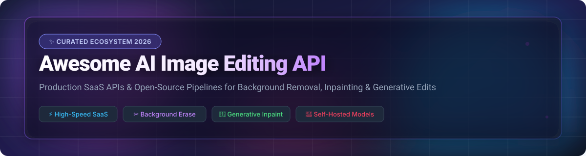

# 🎨 Awesome AI Image Editing API Ecosystem

  
  
  
  
  
  

## 📌 Overview & SEO Summary

Welcome to the definitive, community-curated collection of **AI Image Editing APIs**, **Background Removal APIs**, **Generative Inpainting Tools**, and **Self-Hosted Open-Source Image Processing Pipelines**. 

Whether you are building e-commerce product photography automation, mobile design apps, content moderation workflows, or AI creative tools, this guide indexes the industry leaders across cloud SaaS endpoints and self-hosted models.

**Key Capabilities Tracked:**
* ✂️ **Automated Background Removal & Matting** (u2net, BRIA, BiRefNet, Photoroom, remove.bg)
* 🎨 **AI Image Inpainting & Object Erase** (LaMa, IOPaint, Segment Anything, ControlNet)
* 🔍 **Super-Resolution & Face Restoration** (Real-ESRGAN, SUPIR, FaceFusion)
* ⚡ **Production Cloud Inference APIs** (Fal.ai, Replicate, OpenAI Images, Stability AI, Segmind)

---

## 📊 Market Insights & Sector Overview

> **Market Analysis:** The global **AI Image Editing & Processing API market** is estimated at **~$3.8 Billion in 2026** and projected to exceed **$11.5 Billion by 2030** (CAGR ~24.8%). 
>
> **Market Fragmentation:** The sector is **moderately fragmented**. High-precision niche verticals (such as automated e-commerce background removal like Photoroom and remove.bg) operate alongside massive multi-modal inference providers (OpenAI, Fal.ai, Stability AI). This prevents a single "winner-take-all" consolidation, creating vast opportunities for specialized SaaS micro-services as well as self-hosted open-source pipelines.

---

## ☁️ SaaS / Hosted Commercial APIs

The following cloud platforms offer robust production SLAs, auto-scaling infrastructure, zero-GPU management, and simple REST/GraphQL image editing APIs.

> **Note:** Sorted by **Company Size / Valuation / Revenue** in descending order.

| 🏢 SaaS Platform & API | 🛠️ Core Capabilities | 💰 Starting Tier Price | 🎁 Free Tier / Trial Limit | 📊 Company Size / Valuation |
| :--- | :--- | :--- | :--- | :--- |
| **[OpenAI Images API](https://platform.openai.com/)** | Generative image edit, inpainting, object variation & multi-modal GPT Image endpoints | **$0.005 / image** (GPT Image Mini) to **$0.04 / image** (Standard) | **$5.00 free credit** allowance upon account creation | **$852B–$1.2T Valuation**  *(~$40B ARR)* |
| **[Fal.ai](https://fal.ai/)** | High-speed serverless inference API for FLUX, SDXL, inpainting, ControlNet & custom pipelines | **$0.001 / image** (Serverless GPU from **$0.0002/sec**) | **$10.00 free credit** developer package on initial signup | **$4.0B Valuation**  *(~$100M ARR)* |
| **[Stability AI / Clipdrop](https://stability.ai/)** | Official SDXL, SD 3.5 inpainting, background swap, uncrop, reimagine & studio relighting APIs | **$0.009 / image** (1 credit = $0.01; SDXL at 0.9 credits) | **25 free credits** on signup *(Clipdrop API: 100 dev credits)* | **$1.0B–$1.8B Valuation**  *(~$190M ARR)* |
| **[Photoroom API](https://www.photoroom.com/api)** | Enterprise background removal, AI shadow generation, virtual try-on & product staging APIs | **$20.00 / month** base plan (**$0.02 / image** background edit) | **Unlimited Free Sandbox Mode** *(watermarked)* + 10 trial credits | **$500M Valuation**  *(~$94M ARR)* |
| **[Replicate](https://replicate.com/)** | Cloud API platform for open models (rembg, SAM 2, LaMa, ControlNet, Flux edit, face swap) | **$0.000225 / sec** (Nvidia T4 GPU; ~$0.003–$0.02 / image) | **Free limited runs** on public models without credit card | **$350M Valuation**  *(Acquired by Cloudflare)* |
| **[Bria AI](https://bria.ai/)** | Enterprise-grade responsible generative image editing, background replacement & commercial compliance | **$0.015 / image** (Starter plan from **$29.00 / month**) | **100 free API calls** upon initial developer registration | **~$250M Est. Valuation**  *($65M Total Raised)* |
| **[remove.bg API](https://www.remove.bg/api)** | High-precision automated background eraser for e-commerce, portrait photos & graphics | **$9.00 / month** subscription (**$0.20 / image** pay-as-you-go) | **50 free preview API calls / month** *(up to 0.25 Megapixels)* | **~$100M+ Est. Value**  *(Canva / Leonardo.Ai)* |
| **[Segmind](https://www.segmind.com/)** | Serverless image editing API, inpainting, face restoration & custom model hosting | **$0.0002 / sec** GPU time (**$0.002 / image** edit call) | **100 free API credits** on initial registration | **~$15M Est. Valuation**  *($1.16M Seed Funding)* |
| **[Pixian API](https://pixian.ai/api)** | Low-latency batch background removal API designed for automated e-commerce catalog ingestion | **$0.02 / image** (Pay-as-you-go credit packs from **$5.00**) | **Unlimited free web removals** (0.25 MP) + Free API test mode (`test=true`) | **Bootstrapped / Private**  *(Profitable FOSS & SaaS)* |

---

## 🚀 Open-Source GitHub Repositories

Self-hosted open-source models allow complete control over data privacy, custom fine-tuning, and zero per-image API costs when running on self-hosted GPU infrastructure.

> **Note:** Sorted by **GitHub Star Count** in descending order. Star badges link directly to each repository's stargazers page.

1. **[ComfyUI](https://github.com/comfyanonymous/ComfyUI)**  
     
   🛠️ Modular node-based procedural engine & API backend for chaining background removal, inpainting, ControlNet, and multi-model SDXL/FLUX workflows.

2. **[Segment Anything (SAM & SAM 2)](https://github.com/facebookresearch/segment-anything)**  
     
   🎯 Meta AI's foundation segmentation model for automatic zero-shot object selection, click-to-masking, and precise video/image edits.

3. **[Fooocus](https://github.com/lllyasviel/Fooocus)**  
     
   🎨 Minimalist, image-prompt, inpainting, and outpainting generator built on Stable Diffusion and SDXL engine.

4. **[Real-ESRGAN](https://github.com/xinntao/Real-ESRGAN)**  
     
   🔬 Practical restoration algorithm & super-resolution upscaler for enhancing low-resolution product photos and generated artwork.

5. **[Diffusers](https://github.com/huggingface/diffusers)**  
     
   🤗 Hugging Face's standard Python library for orchestrating Stable Diffusion, FLUX, inpainting, and custom generative image edit pipelines.

6. **[ControlNet](https://github.com/lllyasviel/ControlNet)**  
     
   🎛️ Neural network structure to condition diffusion models with edge maps, depth maps, segmentation masks, and pose estimation.

7. **[FaceFusion](https://github.com/facefusion/facefusion)**  
     
   👤 Next-generation open-source face swapper and enhancer framework with robust CLI, Python SDK, and web interface.

8. **[rembg](https://github.com/danielgatis/rembg)**  
     
   ✂️ Leading open-source background removal tool featuring CLI, Python library, Docker container, and multi-model support (u2net, BRIA, BiRefNet).

9. **[IOPaint (Lama Cleaner)](https://github.com/Sanster/IOPaint)**  
     
   🧹 Open-source image inpainting & erase tool powered by SOTA models (LaMa, MAT, SD Inpainting, Stable Diffusion 3.5).

10. **[LaMa (Resolution-robust Large Mask Inpainting)](https://github.com/advimman/lama)**  
      
    🪄 Fourier-convolutions inpainting architecture to remove unwanted objects and fill large mask regions cleanly.

11. **[IC-Light](https://github.com/lllyasviel/IC-Light)**  
      
    💡 Illumination Connection project for manipulating image lighting, background relighting, and product studio highlights.

12. **[Inpaint-Anything](https://github.com/geekyutao/Inpaint-Anything)**  
      
    🧩 Segment Anything + LaMa + Stable Diffusion pipeline to click, remove, replace, and edit anything inside an image.

13. **[SUPIR](https://github.com/Fanghua-Yu/SUPIR)**  
      
    🖼️ Scaling Up Photo-Realistic Image Restoration with generative prior models for ultra-high detail enhancement.

14. **[BiRefNet](https://github.com/ZhengPeng7/BiRefNet)**  
      
    🔬 Bilateral Reference Network for high-resolution dichotomous image segmentation and ultra-sharp background removal.

---

## 🛠️ How to Contribute

1. Fork this repository.
2. Add your SaaS product or Open-Source project entry following the established table / list format.
3. Ensure exact, verifiable pricing, free trial specs, company valuation, and star count badges are included.
4. Submit a Pull Request (PR) with a clear description of your contribution.

---

## 🤝 Support & Sponsorship

If you find this curated list valuable for your projects or research, please consider supporting the project!

- 🌟 **Star** this repository on GitHub to help others discover it.
- 🔀 **Fork** and share it with fellow developers and AI builders.
- 💖 **Sponsor / Buy me a coffee:** Show support via [GitHub Sponsors](https://github.com/sponsors/ishandutta2007).

---

## 📈 Star History

---

## ⚠️ Disclaimer

- This is a community-curated collection intended for educational and technical reference.
- Verify commercial usage licenses, privacy terms, and rate limits before deploying third-party APIs or open-source models to production.
